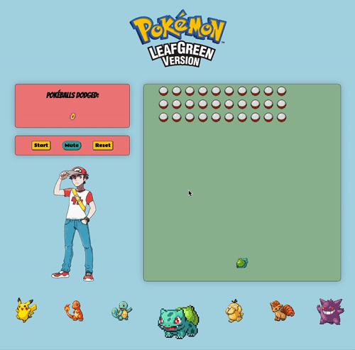

# Poké Dodge!

## Concept
The first game I remember falling in love with was Pokemon LeafGreen Version. It originally launched on the GameBoy Advance - but I played it on the Nintendo DS.  

#### A retro inspired browser game 
_But a post modern commentary on how acceptable is it that the Pokemon games promote the catching of wild animals to force them into battles unwillingly._ (I’m kidding).

I decided to make space invaders - but make it Pokémon. 

## Game functions
Space Invaders has had many variations through the years. If you distill it to its most pure form you get the following: 
* A user ship that shoots 
* Incoming enemies.
* A score board.
* Start / stop buttons.

That’s where Is tarted with my most basic attempt at pseudo coding out the logic for JavaScript.

## Design
Turns out, by choosing Pokémon I had a wealth of assets available to use on the internet. By basing it on a particular game, I even got a colour palette to work with. Soft blues and greens are typical in the Pokemon universe and have been largely unchanged for the 25 years the franchise has been around. 

## Stretch goals
In my version of the game, there is a row of Pokemon at the bottom with what seems to be the Bulbasaur highlighted and chosen for battle in the main game.

With more time for the project, I would’ve developed a Pokemon picker that would let you choose your pokemon and then revealed the information about that Pokemon in the Pokédex. 

